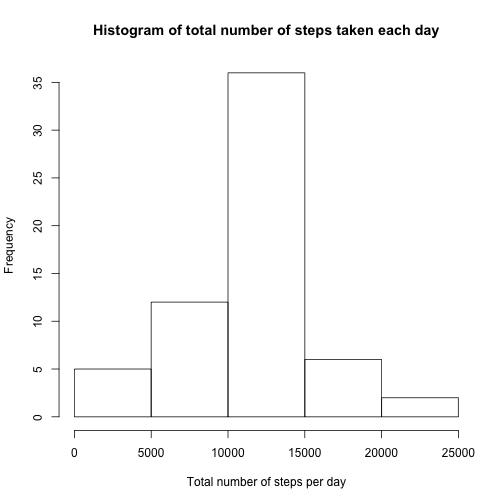

Peer Assessment 1 (Reproducible Research)
=========================================

## Loading and preprocessing the data


```r
activity <- read.csv("activity.csv")
activity$date <- as.Date(activity$date)
```

## What is mean total number of steps taken per day?

### 1. Calculate the total number of steps taken per day.


```r
library(dplyr)
totalSteps <- as.data.frame(activity %>% 
              group_by(date) %>% 
              summarize(steps=sum(steps, na.rm=TRUE)))
```

### 2. Make a histogram of the total number of steps taken each day.


```r
hist(totalSteps$steps, xlab="Total number of steps per day", main="Histogram of total number of steps taken each day")
```

 

### 3. Calculate and report the mean and median of the total number of steps taken per day.


```r
Mean <- mean(totalSteps$steps, na.rm=TRUE)
Median <- median(totalSteps$steps, na.rm=TRUE)
```

The mean of the total number of steps taken per day is 9354.2295082 and median is 10395

## What is the average daily activity pattern?

### 1. Make a time series plot of the 5-minute interval (x-axis) and the average number of steps taken, averaged across all days (y-axis)


```r
averageSteps <- as.data.frame(activity %>% 
                group_by(interval) %>% 
                summarize(meanSteps=mean(steps, na.rm=TRUE)))

plot(meanSteps ~ interval, data = averageSteps, 
     ylab="Steps", main="Average number of steps per interval", type ="l")
```

 

### 2. Which 5-minute interval, on average across all the days in the dataset, contains the maximum number of steps?


```r
maxInterval <- averageSteps$interval[averageSteps$meanSteps==max(averageSteps$meanSteps)]
```

The interval with the maximum number of steps is 835

## Imputing missing values

### 1. Calculate and report the total number of missing values in the dataset.


```r
length(which(is.na(activity)))
```

```
## [1] 2304
```

### 2. Devise a strategy for filling in all of the missing values in the dataset.


- check if an element of "x" is NA
- if the value is NA, group by interval, replace it with the mean of 5 minutes interval of all days.


### 3. Create a new dataset that is equal to the original dataset but with the missing data filled in.


```r
missingData <- activity[,]

for (i in 1:length(missingData$steps)) {
    if(is.na(missingData$steps[i]))
        missingData$steps[i] <- mean(missingData$steps[missingData$interval==missingData$interval[i]], na.rm=TRUE)
}
```

### 4a. Make a histogram of the total number of steps taken each day.


```r
missingTotalSteps <- missingData %>% group_by(date) %>% summarize(Steps=sum(steps))
hist(missingTotalSteps$Steps, xlab="Total number of steps per day", main="Histogram of total number of steps taken each day")
```

 

### 4b. Calculate and report the mean and median total number of steps taken per day.


```r
missingMean <- mean(missingTotalSteps$Steps)
missingMedian <- median(missingTotalSteps$Steps)
```

The new mean of the total number of steps taken per day is 1.0766189 &times; 10<sup>4</sup> and median is 1.0766189 &times; 10<sup>4</sup>

### Do these values differ from the estimates from the first part of the assignment?
Answer: Yes

### What is the impact of imputing missing data on the estimates of the total daily number of steps?

Replacing missing values with the average of the interval improved the distribution of the values by making the data to be more normally distributed (figure under 4a vs under 2).

## Are there differences in activity patterns between weekdays and weekends?

### 1. Create a new factor variable in the dataset with two levels ¨C ¡°weekday¡± and ¡°weekend¡± indicating whether a given date is a weekday or weekend day.


```r
for (i in 1:length(missingData$date)) {
    if (weekdays(missingData$date[i]) %in% c("Saturday", "Sunday")) {missingData$wkday[i] <- "weekend"}
    else {missingData$wkday[i] <- "weekday"}
}
```

### 2. Make a panel plot containing a time series plot of the 5-minute interval (x-axis) and the average number of steps taken, averaged across all weekday days or weekend days (y-axis).


```r
weekday <- missingData[missingData$wkday == 'weekday', c('steps', 'interval')] %>% group_by(interval) %>% summarize(steps=mean(steps), wkday='weekday')
weekend <- missingData[missingData$wkday == 'weekend', c('steps', 'interval')] %>% group_by(interval) %>% summarize(steps=mean(steps), wkday='weekend')

wkdaySteps <- rbind(weekday, weekend)
wkdaySteps <- transform(wkdaySteps, wkday = factor(wkday))

library(lattice)
xyplot(steps ~ interval | wkday, data = wkdaySteps, type = "l", xlab="Interval", ylab="Number of steps", layout = c(1, 2))
```

 
